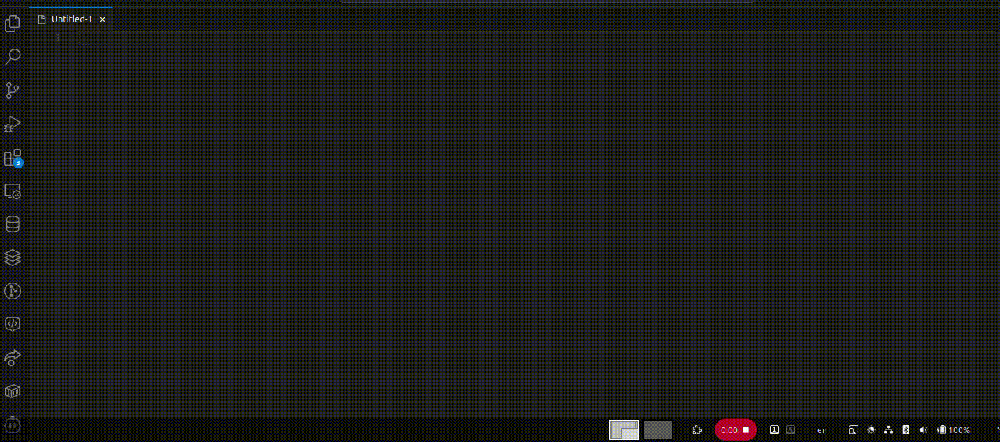

# Dynamic Speech-to-Text with Nerd Dictation on Ubuntu

This repository provides a setup description and a bash script for switching speech-to-text dictation languages based on the currently selected keyboard layout (gnome). The solution is inspired by macOS's seamless speech-to-text experience and is designed and tested on Ubuntu 24.04, although general idea should work for any other Linux system. Main work is done by [Nerd Dictation](https://github.com/ideasman42/nerd-dictation), this repository is a step-by-step guide of making it work, and configuring for good user experience (more "batteries included").

## Features
- Dynamic Language Switching: Automatically selects the dictation language to match the currently active keyboard layout.
- MacOS-Inspired User Experience: Conveniently integrates dictation into your workflow with a shortcut, works in terminal and in UIs.
- Lightweight and Customizable: Uses open-source tools like `dotool` and `vosk`. 
## Demo of language/keyboard layout matching

## Step-by-Step setup guide
### Step 0 - Prerequisites
Ensure the following tools are installed on your system: git, curl, Python 3, Pulseaudio Utilities. Or just install them with   

```bash
sudo apt-get install git curl python3-venv pulseaudio-utils
```
### Step 1: Set Up Python Virtual Environment
```bash
python3 -m venv ~/pythonVENVs/nerd-dictation
source ~/pythonVENVs/nerd-dictation/bin/activate
cd ~/pythonVENVs/nerd-dictation/
./bin/pip3 install vosk
```
### Step 2: Clone Nerd Dictation

```bash
git clone https://github.com/ideasman42/nerd-dictation.git
```
  
### Step 3: Download Language Models for each language
Download and extract models for each language you plan to use.
You can see the available models here: https://alphacephei.com/vosk/models. I only used smallest one for each language, so far no experience how big of a delay/quality imporovement do bigger models bring.

Below are examples for English, German, and Polish (no reason other than this is what I use):
```bash
wget https://alphacephei.com/kaldi/models/vosk-model-small-en-us-0.15.zip
unzip vosk-model-small-en-us-0.15.zip
wget https://alphacephei.com/kaldi/models/vosk-model-small-de-0.15.zip
unzip vosk-model-small-de-0.15.zip
wget https://alphacephei.com/kaldi/models/vosk-model-small-pl-0.22.zip
unzip vosk-model-small-pl-0.22.zip
```
### Step 4: Install `dotool`

[`dotool`](https://sr.ht/~geb/dotool/) will be used to "type" the text recognized from speech to wherever your cursor/focus is. Nerd dictation can work with other tools, and `dotool` is not a default one, but I insisted on something that can work with you UIs and terminals, and preferably does not require a deamon.
Since there is no deb package to install, we're going to have to compile `dotool`, for which we will use docker (so that we do not to have to install all the golang dependencies).

If you do not have a docker installed, install it first (https://docs.docker.com/engine/install/ubuntu/)
When you have a docker installed, the compilation can be done like this:
```bash 
docker run --rm -v $(pwd):/output ubuntu:24.04 bash -c "
apt-get update && apt-get install -y golang-go libxkbcommon-dev scdoc git ca-certificates &&
git clone https://git.sr.ht/~geb/dotool /tmp/dotool &&
cd /tmp/dotool &&
./build.sh &&
cp dotool /output/ &&
echo 'Build complete! Binary copied to current directory.'
"
```
Install `dotool`
```bash
sudo cp dotool /usr/local/bin/
sudo chmod +x /usr/local/bin/dotool
```
Configure Permissions
```bash
sudo usermod -a -G input $USER
echo 'KERNEL=="uinput", GROUP="input", MODE="0660", OPTIONS+="static_node=uinput"' | sudo tee /etc/udev/rules.d/60-dotool.rules
sudo udevadm control --reload-rules
sudo udevadm trigger
```
### Step 5: Configure the script
Copy `nerd-dictations-starter.sh` from this repository to your home folder. Open script in a text editor, locate the `LANGUAGE_MODELS` dictionary at the top of the file. Adjust it's definition to have reflect your of your keyboard layouts and VOSK models, that you downloaded in Step 3.

### Step 6: Add a key-binding
Open Settings > Keyboard > Custom Shortcuts.

Add a new shortcut with:

- Name: Start Dictation
- Command: `sh -c "bash $HOME/nerd-dictations-starter.sh"`
- Assign a convenient keybinding (e.g., Ctrl + Esc). 

It's convenient to choose a shortcut that you can reach with your not-dominant hand easily, if you're planning on using it a lot.
### Step 7: Use it
Use the assigned shortcut to start dictation. Upon starting you should see the notification and microphone becoming active. The language will automatically match your current keyboard layout.

## Troubleshooting

### `dotool` Permission Issues:

Ensure your user is part of the `input` group and that the udev rules are applied.

### Dictation Not Starting:

Verify that the language model paths are correct and that nerd-dictation is installed.
